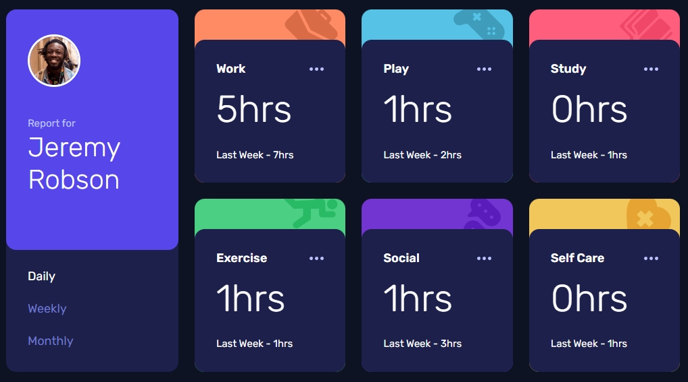
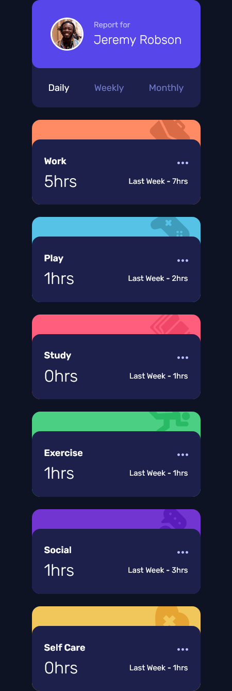

# Frontend Mentor - Time tracking dashboard solution

This is a solution to the [Time tracking dashboard challenge on Frontend Mentor](https://www.frontendmentor.io/challenges/time-tracking-dashboard-UIQ7167Jw). Frontend Mentor challenges help you improve your coding skills by building realistic projects. 

## Table of contents

- [Overview](#overview)
  - [The challenge](#the-challenge)
  - [Screenshot](#screenshot)
  - [Links](#links)
- [My process](#my-process)
  - [Built with](#built-with)
  - [What I learned](#what-i-learned)
  - [Continued development](#continued-development)
  - [Useful resources](#useful-resources)
- [Author](#author)

**Note: Delete this note and update the table of contents based on what sections you keep.**

## Overview

### The challenge

Users should be able to:

- View the optimal layout for the site depending on their device's screen size
- See hover states for all interactive elements on the page
- Switch between viewing Daily, Weekly, and Monthly stats

### Screenshot

### Links

- Solution URL: [Time Tracking Dashboard Solution](https://github.com/cacesasa/time-tracking-dashboard)
- Live Site URL: [Time Tracking Dashboard Live URL](https://your-live-site-url.com)

## My process

### Built with

- Semantic HTML5 markup
- CSS custom properties
- Flexbox
- CSS Grid
- Mobile-first workflow
- [React](https://reactjs.org/) - JS library

### What I learned

This is my first challenge using React, it is a way to keep practicing what I learned.

### Continued development

I want to keep my development with React and JavaScript, to keep improving in my carreer path.

### Useful resources

- [React Redux](https://react-redux.js.org/api/hooks) - This side have a good article about React Hooks.

## Author

- Website - [Carlos Santana](https://cacesasa.github.io/myporfolio/)
- Frontend Mentor - [@cacesasa](https://www.frontendmentor.io/profile/cacesasa)
- Twitter - [@cacesasa](https://www.twitter.com/cacesasa)

